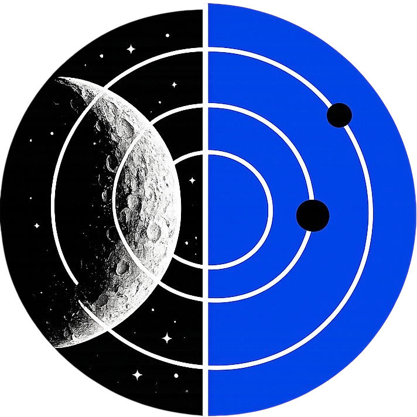

  

<h1 align="center">galakSIM</h1>

  <b>Équipe :</b> Vahan Israyelyan, Zachary Lachapelle, Matis Langlois et Daniil Podvolotki

---

### Description
Le simulateur **galakSIM** permet d'explorer les mécaniques célestes avec une précision scientifique.

* **Interaction intuitive :** Cliquez n'importe où pour générer une planète.
* **Physique en temps réel :** Observez les interactions gravitationnelles instantanément.
* **Analyse de données :** Cliquez sur un astre pour afficher ses graphiques et ses constantes physiques.

### Physique
C'est grâce à la loi universelle de la gravitation découverte par Isaac Newton, que le simulateur peut calculer les interractions entre les astres.

$F = G \frac{m_1 m_2}{d^2}$
